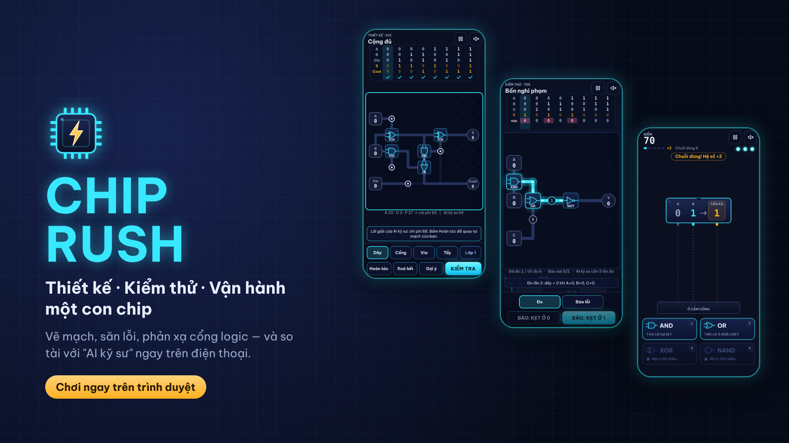

# CHIP RUSH

Game web về vi mạch, chơi trên điện thoại: **Thiết kế** một con chip bằng cách vẽ dây và đặt cổng logic, **Kiểm thử** để tìm cổng hỏng, và **Vận hành** trong chế độ arcade phản xạ. Mỗi chế độ có một "AI kỹ sư" để bạn so tài.

Dự thi **Phần thi Công nghệ – Road to Predator League 2027**.

> Trạng thái: chơi được cả 3 chế độ (12 màn THIẾT KẾ, 6 màn KIỂM THỬ, VẬN HÀNH Vô tận + 60 giây) và **Chip hôm nay** (28 đề quay vòng theo ngày, chuỗi ngày). Đang hoàn thiện và đo hiệu năng trên máy thật trước khi nộp 26/10/2026.



## Chơi thử
- Bản mới nhất: **https://lehngvu0110-pixel.github.io/chip-rush/** (mở trên điện thoại cho trải nghiệm đúng nhất)
- Thêm `?debug=1` vào cuối link để hiện bảng đo hiệu năng (FPS, thời gian khung hình).

## Ba chế độ
| Chế độ | Kiểu chơi | Khái niệm vi mạch |
| --- | --- | --- |
| VẬN HÀNH | Arcade: chọn cổng AND/OR/XOR/NAND trước khi gói bit chạm đáy | Cổng logic |
| THIẾT KẾ | Giải đố: vẽ dây, đặt cổng, làm LED sáng đúng mọi trường hợp | Routing, bảng chân trị, via, bộ cộng, PPA |
| KIỂM THỬ | Suy luận: đo các điểm trên mạch để tìm cổng hỏng hoặc dây kẹt | Probing, fault model (gate-invert, stuck-at), lớp lỗi tương đương |

Thêm **Chip hôm nay**: mỗi ngày (giờ Việt Nam) một đề THIẾT KẾ giống nhau cho mọi người, giữ chuỗi ngày và chia sẻ điểm.

Luật chi tiết: [`docs/SPEC.md`](docs/SPEC.md).

## AI trong game và trong quá trình làm game
- **Trong game** — "AI kỹ sư", AI cổ điển (tìm kiếm + suy luận), không gọi API, không học từ dữ liệu người chơi:
  - **THIẾT KẾ** (`src/ai/design-solver.ts`): đặt cổng bằng vét cạn/beam search, cắt nhánh bằng **branch-and-bound** với cận dưới (BFS cho net 2 chân, nửa chu vi hộp bao cho net nhiều chân), đi dây bằng Dijkstra-Steiner và **PathFinder** (negotiated congestion — thuật toán đi dây FPGA kinh điển). Tính trước offline (`tools/solve-levels.ts`) thành "par"; **chứng minh tối ưu 7/12 màn** (vét cạn và Area bằng cận dưới), các màn còn lại người chơi có thể vượt AI.
  - **KIỂM THỬ** (`src/ai/debug-solver.ts`): cây quyết định **minimax** trên tập lớp lỗi (bitmask + ghi nhớ) → số lần đo ít nhất trong trường hợp xấu nhất; tối ưu ở cả 6 màn, đối chiếu bằng vét cạn mọi cây trong test. Màn hướng dẫn t01 dùng chính solver này để chỉ dây nên đo tiếp.
  - **VẬN HÀNH** (`src/ai/adaptive.ts`): **Thompson sampling** (Beta-Bernoulli) chọn loại gói người chơi hay sai, trộn 30% ngẫu nhiên.
  - **Minh bạch trong game:** trang "AI kỹ sư hoạt động thế nào?" (Cài đặt hoặc danh sách màn) nêu thuật toán, số màn đã chứng minh tối ưu và giới hạn; sau mỗi màn KIỂM THỬ có nút "Xem AI kỹ sư đo" phát lại từng bước suy luận; VẬN HÀNH báo ngay khi AI bắt đầu ra thêm câu về cổng bạn hay sai.
  - Giới hạn và cách kiểm chứng từng thuật toán: [`docs/SPEC.md` mục 5](docs/SPEC.md); quyết định thiết kế: [ADR-0007](docs/adr/0007-solver-thiet-ke.md), [ADR-0008](docs/adr/0008-kiem-thu-minimax.md).
- **Trong quá trình phát triển:** dùng trợ lý AI để lên kế hoạch, viết code, viết tài liệu. Toàn bộ được ghi lại ở [`docs/ai-log/`](docs/ai-log/).

## Chạy trên máy
Cần Node.js ≥ 20.
```bash
npm install
npm run dev        # mở http://localhost:5173 ; điện thoại cùng Wi-Fi mở http://<IP-máy>:5173
npm test           # unit test
npm run build      # build ra thư mục dist/
npm run ci         # typecheck + test + build + kiểm tra dung lượng
npx playwright install chromium webkit   # lần đầu
npm run e2e        # test đầu-cuối trên bản build
```

## Tài liệu
| File | Nội dung |
| --- | --- |
| [docs/SPEC.md](docs/SPEC.md) | Luật chơi, công thức điểm, AI |
| [docs/GDD.md](docs/GDD.md) | Thiết kế trải nghiệm, hình ảnh, âm thanh |
| [docs/ARCHITECTURE.md](docs/ARCHITECTURE.md) | Kiến trúc code |
| [docs/adr/](docs/adr/) | Các quyết định kỹ thuật lớn |
| [docs/LEVELS.md](docs/LEVELS.md) | Danh sách màn chơi |
| [docs/TESTING.md](docs/TESTING.md) | Thiết bị, ma trận test, số đo hiệu năng |
| [docs/COMPLIANCE.md](docs/COMPLIANCE.md) | Đối chiếu điều lệ cuộc thi |
| [docs/ASSETS.md](docs/ASSETS.md) | Nguồn gốc và giấy phép mọi tài nguyên |
| [docs/DEVLOG.md](docs/DEVLOG.md) | Nhật ký phát triển |
| [docs/SUBMISSION.md](docs/SUBMISSION.md) | Nội dung nộp bài, ảnh logo/in-game ở `docs/submission/` |
| [CHANGELOG.md](CHANGELOG.md) | Thay đổi theo phiên bản |

## Quyền riêng tư
Game không thu thập dữ liệu cá nhân, không dùng cookie, không gọi máy chủ nào sau lần tải đầu. Tiến độ chỉ lưu trong trình duyệt của bạn (`localStorage`).

## Tác giả
| Họ tên | MSSV | Trường |
| --- | --- | --- |
| Lê Hoàng Vũ | _(điền)_ | Trường ĐH Bách Khoa – ĐHQG-HCM |

## Giấy phép
Mã nguồn: [MIT](LICENSE). Font Be Vietnam Pro: [SIL Open Font License 1.1](src/assets/fonts/OFL.txt).
